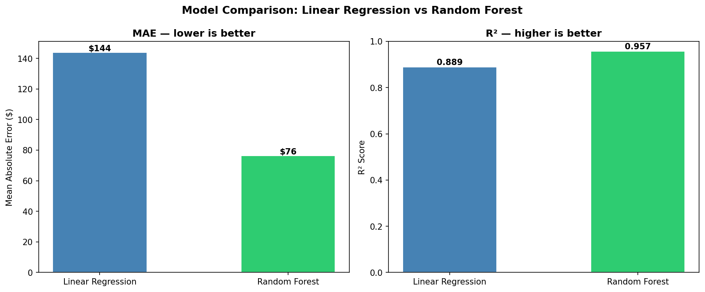
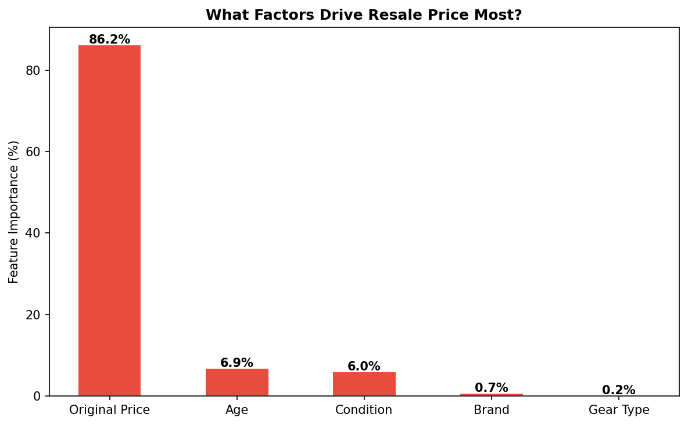
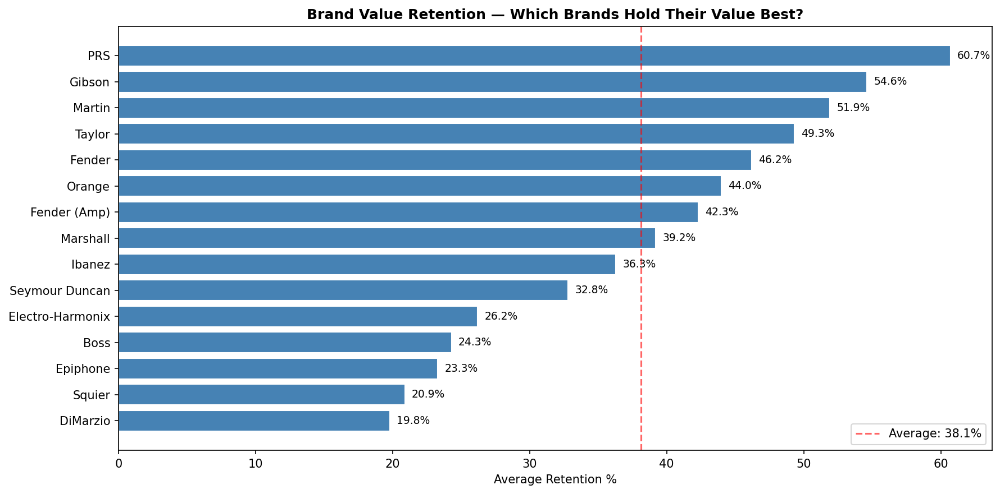
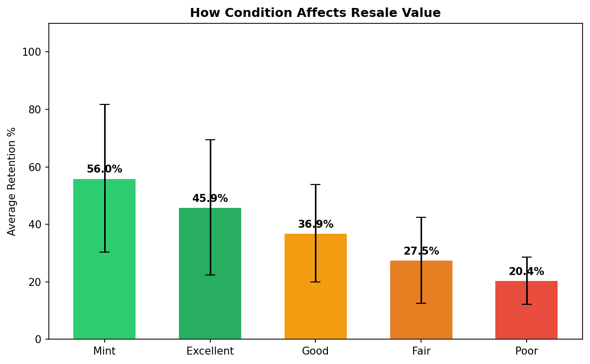
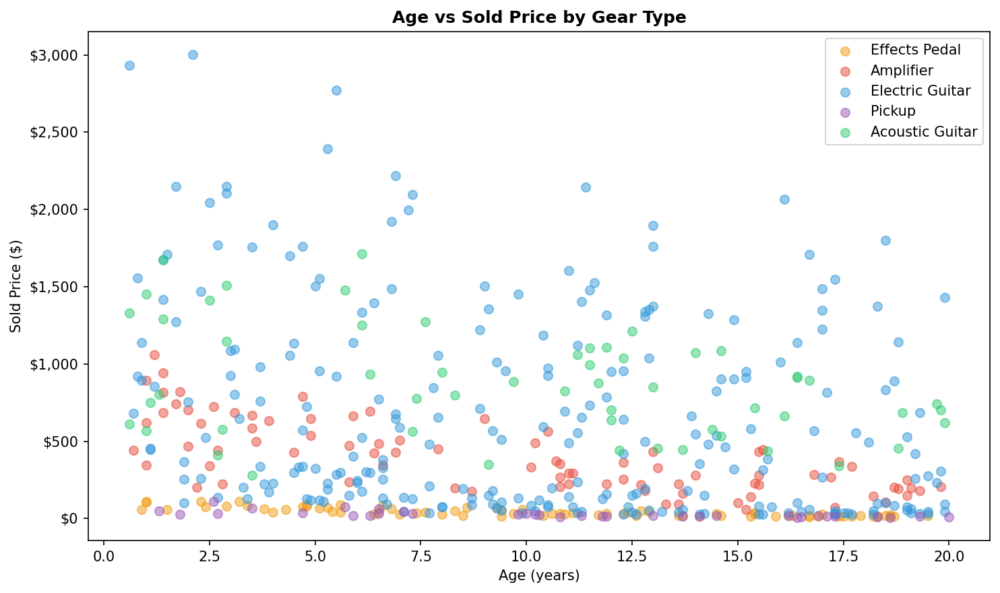
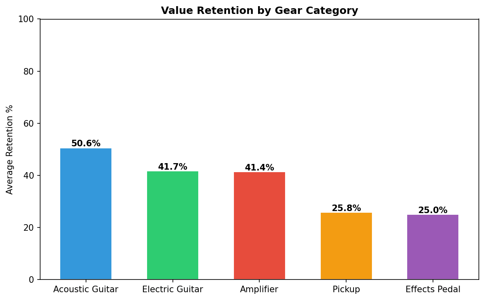
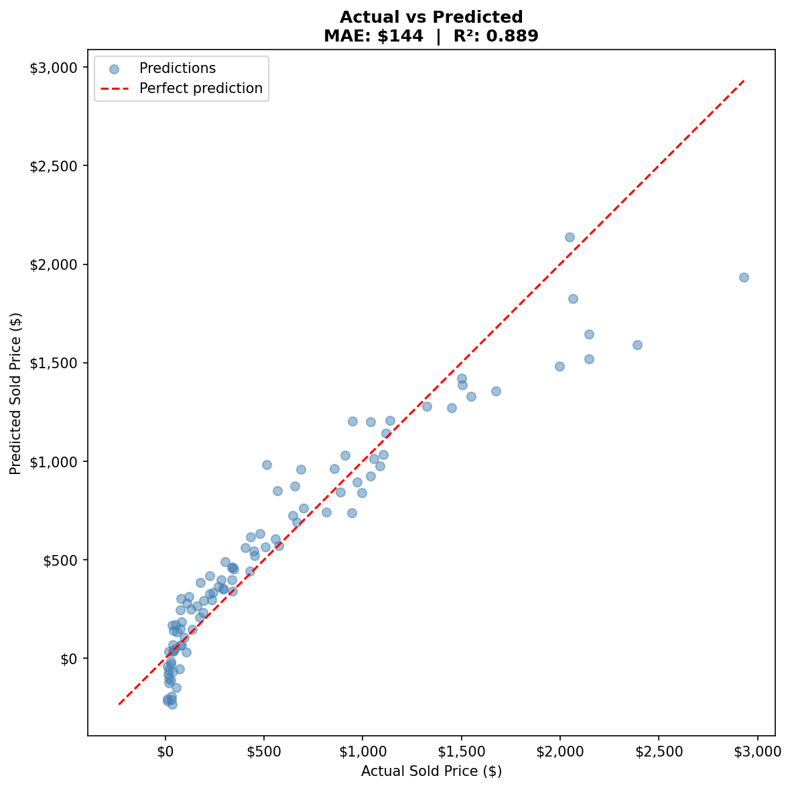

# Guitar Gear Value Predictor

> ML pipeline for predicting second-hand guitar gear resale prices, with model comparison, feature importance analysis, interactive visualizations, and Claude AI-powered valuation reports.

## Overview

This project builds an end-to-end machine learning pipeline on a 500-listing guitar gear dataset. It compares Linear Regression against Random Forest, identifies the key drivers of resale value through feature importance analysis, and wraps predictions in an AI valuation tool that reasons against EDA-derived market data using the Anthropic Claude API.

---

## Model Performance

Two models trained and evaluated on an 80/20 train-test split (`random_state=42`):

| Model | MAE | R² | Winner |
|-------|-----|----|--------|
| Linear Regression | $143.90 | 0.889 | |
| Random Forest (n=100) | $76.31 | 0.957 | ✓ |

Random Forest reduced mean absolute error by **47%** and explains **95.7%** of variance in resale price. The winning model is automatically saved to `gear_model.pkl` by `model_comparison.py`.



---

## Feature Importance

Random Forest's `feature_importances_` attribute reveals what actually drives resale price:



`original_price` dominates as the strongest predictor — unsurprising, but the relative weights of `condition` vs `age` are more interesting. Condition has a disproportionate effect compared to raw age, suggesting buyers discount gear for cosmetic/functional state more aggressively than for vintage.

---

## EDA Findings

All EDA charts are available as both static PNGs (matplotlib) and **interactive HTML files** (Plotly) — hover, zoom, and filter in browser.

### Brand Value Retention



| Tier | Brands | Avg Retention |
|------|--------|---------------|
| Premium | PRS, Gibson, Martin, Taylor | 49–61% |
| Mid | Fender, Orange, Marshall | 39–46% |
| Budget | Ibanez, Boss, Epiphone, Squier, DiMarzio | 20–36% |

PRS leads at **60.7%** — the only brand consistently retaining above 60%. Budget brands (Squier, DiMarzio) drop below 20%, losing more than 4/5 of original value.

### Condition Effect



Mint → Poor represents a **~65 percentage point** swing in retention. Condition is the single most actionable variable for a seller.

### Age vs Price



Scatter shows strong price clustering by gear type. Electric guitars dominate the upper price range regardless of age, while effects pedals and pickups cluster near zero — suggesting category matters more than age for certain gear types.

### Gear Category



Guitars consistently outperform amps and effects in retention — category selection matters as much as brand for long-term value preservation.

---

## AI Valuation Tool

`predict.py` loads the trained Random Forest model and makes two Claude API calls per valuation:

**Prompt 1 — EDA-Aware Valuation Report**

Injects brand average retention from EDA findings alongside the prediction, asking Claude to reason about *why* this specific listing deviates from the brand average. This produces analysis grounded in actual market data rather than generic advice.

**Prompt 2 — Market Trend Analysis**

Passes the full brand retention dataset to Claude and asks for market-level pattern recognition and buyer recommendations.

Both calls use `claude-haiku-4-5-20251001` with `max_tokens=500/400` respectively.

---

## Actual vs Predicted



Points cluster tightly around the diagonal — predictions track well across the full price range ($0–$3,000). Wider spread at higher price points reflects natural variance in premium gear pricing.

---

## Project Structure

```
├── analysis.py              # EDA with matplotlib — 5 static charts
├── analysis_plotly.py       # EDA with Plotly — 4 interactive HTML charts
├── model.py                 # Baseline Linear Regression
├── model_comparison.py      # LR vs Random Forest, feature importance, saves winner
├── predict.py               # CLI tool — ML prediction + Claude API valuation
├── data/
│   └── guitar_gear_listings.xlsx
```

---

## Setup

```bash
git clone https://github.com/Kiana-ko/guitar-gear-value-predictor.git
cd guitar-gear-value-predictor

pip install pandas scikit-learn matplotlib plotly openpyxl joblib anthropic python-dotenv

# Create .env with your Anthropic API key
echo "ANTHROPIC_API_KEY=your_key_here" > .env
```

## Run Order

```bash
python analysis.py           # EDA + static charts
python analysis_plotly.py    # EDA + interactive HTML charts (opens in browser)
python model_comparison.py   # Train both models, compare, save winner
python predict.py            # Interactive valuation CLI + AI report
```

---

## Tech Stack

| Category | Tools |
|----------|-------|
| Data processing | pandas, openpyxl |
| Machine learning | scikit-learn — LinearRegression, RandomForestRegressor |
| Static visualization | matplotlib |
| Interactive visualization | plotly |
| AI / LLM | Anthropic Claude API (Haiku) |
| Model persistence | joblib |
| Environment | python-dotenv |

---

## Feature Engineering

Text columns encoded before model training:

- `condition` → **ordinal encoding** (Mint=5, Excellent=4, Good=3, Fair=2, Poor=1) — order preserved
- `brand`, `gear_type` → **label encoding** via `sklearn.LabelEncoder` — arbitrary integers, no implied order

Encoders saved alongside the model (`encoder_brand.pkl`, `encoder_geartype.pkl`) to ensure consistent transformation at inference time.